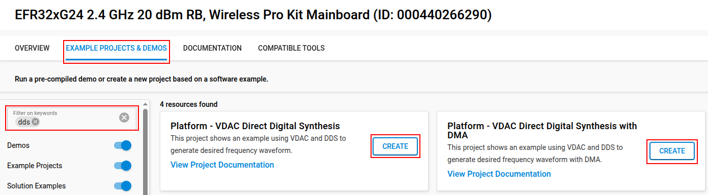
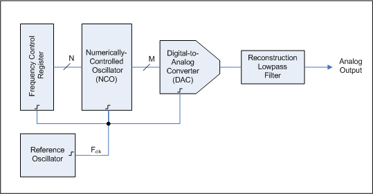

# Platform - Direct Digital Synthesis (DDS) DAC #

## Overview ##

This example demonstrates the signals generation with different frequencies using Direct Digital Synthesis (DDS). DDS is a technique for creating precise, programmable signals. This example can be used for music or audio synthesis as well. This project contains two examples one using DMA and one using non DMA to generate the signals.

## SDK version ##

[SiSDK v2025.6.2](https://github.com/SiliconLabs/simplicity_sdk/releases/tag/v2025.6.2)

## Software Required ##

- [Simplicity Studio v5 IDE](https://www.silabs.com/developers/simplicity-studio)

## Hardware Required ##

## Connections Required ##

Connect the board via the connector cable to your PC to flash the example.

## Setup ##

To test this application, either create a project based on an example project or start with an "Empty C Project" project based on the desired hardware.

### Create a project based on an example project ###

1. Make sure that this repository is added to [Preferences > Simplicity Studio > External Repos](https://docs.silabs.com/simplicity-studio-5-users-guide/latest/ss-5-users-guide-about-the-launcher/welcome-and-device-t2abs).

2. From the Launcher Home, add your product name to My Products, click on it, and click on the **EXAMPLE PROJECTS & DEMOS** tab. Find the example project filtering by "dds".

3. Click the **Create** button on **Platform - VDAC Direct Digital Synthesis** or **Platform - VDAC Direct Digital Synthesis with DMA** example. Example project creation dialog pops up -> click Create and Finish and the project should be generated.

4. Build and flash this example to the board.

    

### Start with an "Empty C Project" project ###

1. Create an **Empty C Project** project for your hardware using Simplicity Studio 5.

2. Select the subfolder in the `inc` folder that corresponds to your board number. Copy all files from that subfolder into the project root folder (overwriting the existing file).

3. Copy all files in the `src` folders into the project root folder (overwriting the existing file).

4. Install the software components:

    3.1. Open the .slcp file in the project

    3.2. Select the SOFTWARE COMPONENTS tab

    3.3. Install the following components:

    - [Platform] → [Driver] → [Button] → [Simple Button] → btn0 and btn1

    - [Platform] → [Peripheral] → EMLIB → [VDAC]

    - [Platform] → [Driver] → [DMADRV]

5. Build and flash the project to your board.

## How It Works ##

Direct Digital Synthesis (DDS) is a technique for generating waveforms digitally by calculating each sample value in real time. The core of DDS is a phase accumulator, which increases by a fixed increment on each clock cycle. The output waveform is generated by mapping the phase accumulator value to a waveform table (such as a sine table).

The frequency of the output signal is determined by the formula:

$$\text{Output Frequency} = \frac{\text{Phase Accumulator} \times \text{DAC Sample Rate}}{2^{N}}$$

where $N$ is the number of bits in the phase accumulator.

## Test measurement ##

To validate the result, connect the DAC output pin to an oscilloscope to visualize the waveform and its frequency.

You can press button 1 to change the waveform (SIN, TRIANGLE, SQUARE) and button 0 to increase the frequency.
