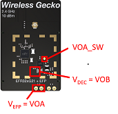

# Platform - EFP01 #

## Overview ##

This project demonstrates the Silicon Labs EFP01 power management IC (PMIC) functionality when paired with an EFR32xG21 wireless MCU on BRD4179B. The EFP0104 device supplies DVDD and AVDD rails and can optionally power the EFR32 DECOUPLE pin (internal regulator rail) for improved system efficiency.

Key features:

* Default EFP0104 configuration powers the EFR32xG21 DVDD and AVDD.
* Optional: Generate custom EFP01 configurations using the EFP01 Configuration Utility (see [AN1245](https://www.silabs.com/documents/public/application-notes/an1245-efp01-configuration-tool-guide.pdf)).
* Runtime control of the EFP0104 DECOUPLE handoff (VOB → DECOUPLE, disabling internal regulator).
* Toggle VOA_SW switched output to demonstrate external load control.
* Interactive operation via push buttons: EM0/EM2 switching (PB0), VOA_SW toggle (PB1).

Peripherals used: CMU, EMU, GPIO, RMU, I2C, EFP driver.

## SDK version ##

* [Simplicity SDK v2025.6.2](https://github.com/SiliconLabs/simplicity_sdk/releases/tag/v2025.6.2)

## Hardware Required ##

* Wireless Starter Kit (WSTK) Mainboard (SLWMB4001A / BRD4001A)
* EFR32xG21 + EFP 2.4 GHz 10 dBm Radio Board (BRD4179B)

| Board ID | Description |
|----------|-------------|
| BRD4179B | EFR32MG21A010F1024 + EFP0104 |

## Connections Required ##

All connections are on-board. No external wiring is needed for basic operation.

To verify VOA_SW output toggling, connect a multimeter or oscilloscope probe to the VOA_SW testpoint on BRD4179B (refer to board documentation or image below).

## Setup ##

You can either create a project directly from this example or start from an empty project.

### Create a project based on an example project ###

1. Add this repository to External Repos in Simplicity Studio.
2. Locate **Platform - EFP01 Feature Demo** (filter for `efp`).
3. Create, build and flash to BRD4179B.

### Start with an empty example project ###

1. Create an **Empty C Project** for BRD4179B.
2. Copy this example's `src` and configuration files.
3. Install software components:
   * [Platform] → [Peripheral] → [GPIO]
   * [Platform] → [Peripheral] → [I2C]
   * [Platform] → [Driver] → [EFP01 Driver]
   * [Platform] → [Services] → [Power Manager]
4. Build and flash.

## How It Works ##

### Execution Flow ###

1. **Chip Initialization**: Apply device-specific errata fixes.
2. **GPIO Trap**: Hold PB1 during reset to maintain debug access if firmware enters bad state (development safety net).
3. **GPIO Setup**: Configure PB0, PB1 inputs with external interrupts; LED0, LED1 outputs.
4. **EFP01 Initialization**: Establish I2C communication, load configuration registers.
5. **DECOUPLE Handoff**: Enable DCDC B output (VOB) to supply EFR32 DECOUPLE pin, then issue Secure Element command to disable internal regulator → improved efficiency.
6. **Main Loop**: Poll global flags set by button ISRs:
   * **PB0 pressed**: Toggle between EM0 (LED0 ON) and EM2 (LED0 OFF). Demonstrates low-energy mode operation with EFP powering.
   * **PB1 pressed**: Toggle VOA_SW output ON/OFF. Verify with testpoint voltage measurement.

### Control Signals ###

| Button | Action |
|--------|--------|
| PB0 | Toggle EM0 ↔ EM2 (LED0 indicates active mode) |
| PB1 | Toggle EFP0104 VOA_SW output |

## Testing ##

1. Flash project to BRD4179B.
2. Observe LED0 ON (EM0 active).
3. Press PB0 → LED0 turns OFF (EM2). Current drops (measure via WSTK AEM or external ammeter on VMCU).
4. Press PB0 again → return to EM0, LED0 ON.
5. Measure VOA_SW testpoint voltage.
6. Press PB1 → VOA_SW voltage toggles between ~0V and configured output (typically ~1.8V or ~3.3V depending on settings).
7. Repeat PB1 presses to confirm output switching.

## Additional Notes ##

* **Custom Configurations**: Use Simplicity Studio's EFP01 Configuration Utility to generate a new `sl_efpdrv_calc.h` with different voltages, sequencing, or output current limits.
* **BRD4181A Comparison (No EFP)**: To measure power savings, define `USINGBRD4181` (line ~55 of `main_efp01_feature_demo.c`) and run on BRD4181A. Comment out EFP-specific calls. Compare EM2 current between the two boards.
* **Porting to xG22 or other devices**: BRD4179B is the only official xG21+EFP board. For other Series 2 devices, explicitly enable peripheral clocks (xG21's on-demand clock gating differs). EFP integration requires hardware support (I2C, GPIO, power sequencing).
* **Testpoint Locations**: Refer to BRD4179B schematic or silkscreen for VOA_SW and other EFP measurement points.
* Flash/RAM estimates based on typical build; adjust after actual compilation if significantly different.
