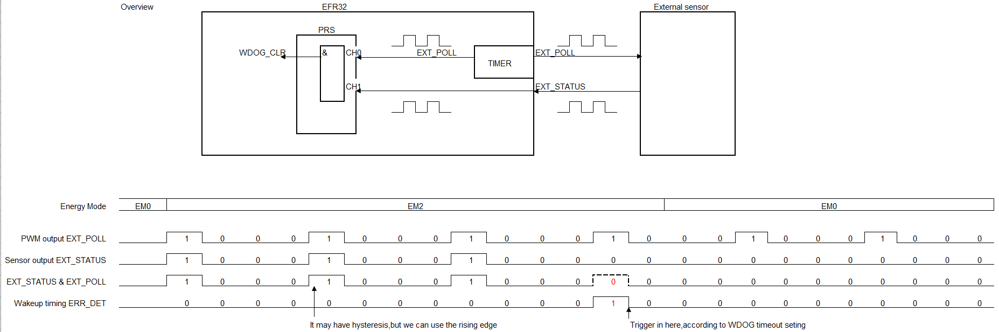
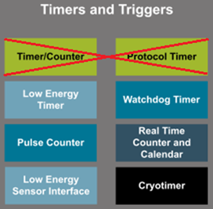
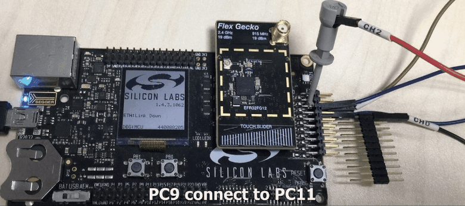
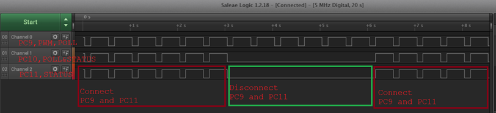

# Platform - Sensor Alive Check in Low Power EM2 Mode #

## Overview ##

This project configures several peripherals to work together in low power EM2 mode, implement sensor activity auto detect. The sensor needs MCU (EFR32 device) output a pluse into it, then it feedback the same plause, if MCU can not catch the feedback status pluse input with in a certain time, it can regard as the sensor is crash or not working.

Detect block:

Working timer in EM2:

## SDK version ##

- [Gecko SDK v4.5.0](https://github.com/SiliconLabs/gecko_sdk/releases/tag/v4.5.0)

## Hardware Required ##

- One Wireless Starter Kit (WSTK) Mainboard, BRD4002A
- One Radio board, BRD4253A
<https://www.silabs.com/products/development-tools/wireless/proprietary/slwrb4253a-efr32-flex-gecko-915-mhz-radio-board>

## Connections Required ##

- Connect the Kit to the PC through an USB cable.

## Setup ##

1. Make sure that this repository is added to [Preferences > Simplicity Studio > External Repos](https://docs.silabs.com/simplicity-studio-5-users-guide/latest/ss-5-users-guide-about-the-launcher/welcome-and-device-tabs).

2. From the Launcher Home, add your device to My Products, click on it, and click on the **EXAMPLE PROJECTS & DEMOS** tab. Find the example project filtering by **sensor alive**.

3. Click **Create** button on the **Platform - Sensor Alive Check in Low Power EM2 Mode** example. Example project creation dialog pops up -> click Create and Finish and Project should be generated.

4. Build and flash this example to the board.

## How It Works ##

Used Peripherals: LETIMER (PWM), WDT, GPIO (POLL and STATUS), PRS (2 channels).  
Use LETIMER to generate PWM, WDOG for timeout (ERR_DET) checking, here call it ERR_TIMER.

1. Use timer generate 1 PWM signal, which is EXT_POLL output to external sensor. Also use as the input of the PRS CH0.
2. Sensor reply EXT_STATUS use as the input of the PRS CH1.
3. Get an AND reflex from CH0 and CH1, we call it "EXT_STATUS & EXT_POLL"
4. "EXT_STATUS & EXT_POLL" on PRS CH0, use for ERR_TIMER clear.
5. PWM and ERR_TIMER start at the same time.
6. If sensor response normal, ERR_TIMER interrupt will never trigger, because PRS clear it peroid.
7. If it trigger it means error, MCU wakeup by interrupt.

Test Result  
Test on BRD4253A, LED1 toggle when wake up, to test EM2 current, please remove LED control in ISR.

- PC9--POLL
- PC10--POLL&STATUS, for test only
- PC11--STATUS.

