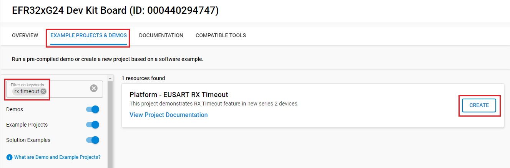
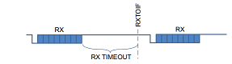
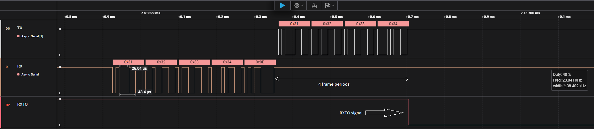

# Platform - EUSART RX Timeout #

## Overview ##

This project demonstrates the RX Timeout feature on EFR32 devices.

The RX timeout feature is designed to detect when the receiver has been idle for a specified period after receiving data, allowing the system to efficiently process received data without waiting indefinitely for more bytes. For devices such as EFR32xG1, EFR32xG13, and EFR32xG22, the RX timeout is implemented using a timer comparator. For newer EUSART devices, such as EFR32xG23, EFR32xG24, EFR32xG27, and EFR32xG28, there is a dedicated RX timeout feature.

## SDK version ##

- SiSDK v2025.6.2

## Hardware Required ##

* Boards: Boards: Silicon Labs Wireless Pro Kit Mainboard (SLWMB4002A, formerly BRD4002A) along with one of the following supported radio boards.
* Devices: EFR32xG24

| Board ID | Description  |
| ---------------------- | ------ |  
| BRD4186C | [EFR32xG24 Wireless 2.4 GHz +10 dBm Radio Board](https://www.silabs.com/development-tools/wireless/xg24-rb4186c-efr32xg24-wireless-gecko-radio-board?tab=overview)|
| BRD4187C | [EFR32xG24 Wireless 2.4 GHz +20 dBm Radio Board](https://www.silabs.com/development-tools/wireless/xg24-rb4187c-efr32xg24-wireless-gecko-radio-board?tab=overview)|
| BRD2601B | [EFR32xG24 Dev Kit](https://www.silabs.com/development-tools/wireless/efr32xg24-dev-kit)|
	  
## Connections Required ##

Connect the board to your PC using a micro-USB cable. This connection is used to flash the example and establish the VCOM connection with the host PC.

## Setup ##

1. Make sure that this repository is added to [Preferences > Simplicity Studio > External Repos](https://docs.silabs.com/simplicity-studio-5-users-guide/latest/ss-5-users-guide-about-the-launcher/welcome-and-device-tabs).

2. From the Launcher Home, add your device to My Products, click on it, and click on the **EXAMPLE PROJECTS & DEMOS** tab. Find the example project filtering by **rx timeout**.

3. Click **Create** button on the **Platform - EUSART RX Timeout** example. Example project creation dialog pops up -> click Create and Finish and Project should be generated.

    

4. Build and flash this example to the board.

## How It Works ##

For newer devices with EUSART like EFR32xG23, EFR32xG24, EFR32xG27, and EFR32xG28, there is a dedicated RX timeout feature:

### Configuration ###

- Set EUSART_CFG1_RXTIMEOUT to values from DISABLED to xFRAMES (1-7 frame periods)
- Only applicable in asynchronous mode (CFG0.SYNC set to 'ASYNC')

*Timeout Values*:

- DISABLED (0)
- ONEFRAME through SEVENFRAMES (1-7)

### Operation ###

- Timer starts after successful frame reception
- The EUSART_IF_RXTO interrupt flag is set if a timeout occurs before the next RX start bit
- The timer resets if another frame arrives before the timeout expires

> [!NOTE]
> The timer does not start in these scenarios:
>
> - If auto baud rate detection is enabled and the baud rate has not been found.
>
> - If a frame is received while RX is blocked.
>
> - If EUSART_CFG0_SKIPPERRF is set and a frame with a parity error is received.

## Testing ##
In this example, EUSART1 is configured for asynchronous operation at 115200 baud with 8 data bits, no parity, and one stop bit (115200N81). EUSART_CFG1_RXTIMEOUT is set to 4 frame periods. If a timeout occurs before the next RX start bit is received, the EUSART_IF_RXTO flag is set, which can be visualized as a pulse-down signal on a GPIO (PB00 in this example).

1. Open a terminal program such as [Tera Term](https://ttssh2.osdn.jp/index.html.en), or just *Launching Console* in Simplicity Studio
2. Send 4 bytes to terminal program
3. Use a logic analyzer to verify that an RXTO event occurs.

    