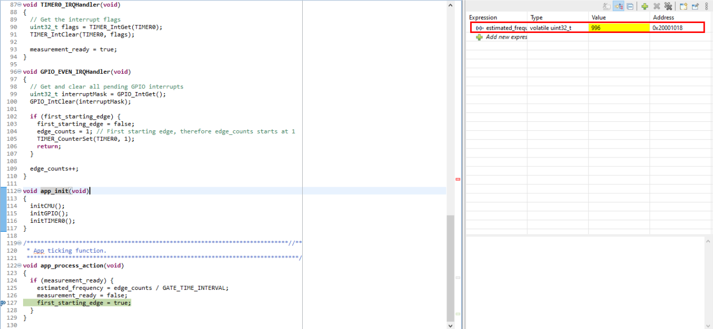

# Platform - Fixed Gate Time - Frequency Measurement #

## Summary ##

This project demonstrates frequency measurement using the Fixed Gate Time method. The timer is configured to count the number of input signal edges (pulses) occurring within a fixed time window (gate interval). At the end of each gate interval, the frequency is calculated based on the number of pulses counted during that interval.

This approach is ideal for measuring the frequency of periodic signals, especially at low frequencies. The measured value provides an estimate of the frequency of the signal source.

## SDK Version ##

- [SiSDK v2025.6.0](https://github.com/SiliconLabs/simplicity_sdk/releases/tag/v2025.6.0)

## Software Required ##

- [Simplicity Studio v5 IDE](https://www.silabs.com/developers/simplicity-studio)

## Hardware Required ##

- 1x Silicon Labs EFR32 device, such as:
  - [Silicon Labs EFR32xG24 Radio Board (BRD4186C)](https://www.silabs.com/development-tools/wireless/xg24-rb4186c-efr32xg24-wireless-gecko-radio-board?tab=overview) and Wireless Starter Kit
  - [EFR32xG24 Explorer Kit](https://www.silabs.com/development-tools/wireless/efr32xg24-explorer-kit?tab=overview)
  - [BGM220 Explorer Kit](https://www.silabs.com/development-tools/wireless/bluetooth/bgm220-explorer-kit?tab=overview)
- A source of periodic signal, which should be connected to the input GPIO

## Connections Required ##

- Connect the periodic signal to the input GPIO pin, which may vary depending on your application. Additionally, ensure the periodic signal source and the board share a common ground (GND).

> [!TIP]
> Refer to the official Silicon Labs documentation for the correct hardware layout of the board.

## Setup ##

### Create from EXAMPLE PROJECTS & DEMOS ###

1. From the Launcher Home, add your hardware to My Products, click on it, and go to the EXAMPLE PROJECTS & DEMOS tab. Find the example project by filtering for "gate time interval".

2. Create the project in Simplicity Studio.

### Create from an empty example project ###

1. Create an **Empty C Project** project for your hardware using Simplicity Studio 5.

2. Copy the .c files 'src/app.c' to the following directory of the project root folder (overwriting the existing files).

3. Install the software components:

    - Open the .slcp file in the project.

    - Select the SOFTWARE COMPONENTS tab.

    - Uninstall the following components:
        - [Services] → [Device Initialization] → [Automatic Device Initialization]
        - [Services] → [Clock Manager] → [Clock Manager]

    - Install the following components:
        - [Platform] → [Peripheral] → [EMLIB] → [TIMER]
        - [Platform] → [Peripheral] → [EMLIB] → [GPIO]
        - [Platform] → [Peripheral] → [EMLIB] → [CMU]

4. Build and flash this project to the board.

## How It Works ##

The gate time interval method uses a timer to define a fixed time window (gate interval), during which the number of input signal edges (pulses) is counted. At the end of each gate interval, the frequency is calculated as:

    Frequency (Hz) = Number of pulses counted / Gate time interval (seconds)

This method is especially useful for measuring the frequency of low-frequency signals, as it improves accuracy by increasing the gate interval. The timer module is configured to generate an interrupt at the end of each gate interval, at which point the pulse count is read and the frequency is updated.

## Testing ##

It is recommended to verify the measured frequency in debug mode, since printing may affect timing and lead to inaccurate readings. Connect the signal source to the input capture pin. Enable debug mode, set a breakpoint after the frequency calculation, and observe the measured value. The result should be similar to the following:

## Reporting Bugs/Issues and Posting Questions and Comments ##

To report bugs in the Application Examples projects, please create a new issue in the Issues section of this repository. Please include the board, project, relevant source files, and line numbers. If you propose a fix, please include details about your proposed solution. Since these examples are provided as-is, there is no guarantee that these examples will be updated to fix these issues.

Questions and comments related to these examples should be made by creating a new "Issue" in the "Issues" section of this repo.
