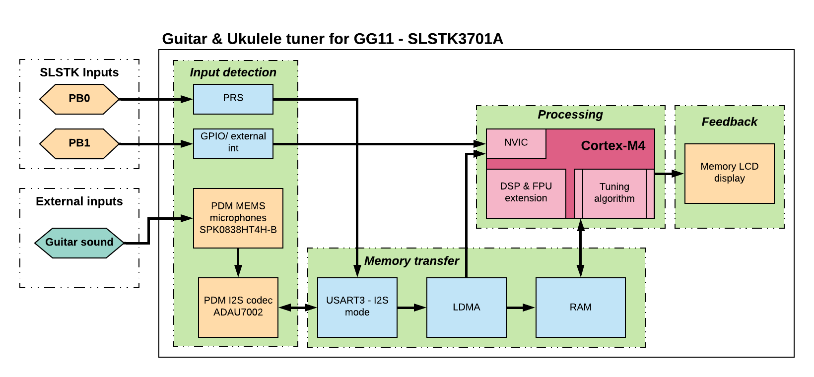

# Platform - Guitar and Ukulele Tuner #

## Summary ##

The purpose of this project is to demonstrate the usage of the Giant Gecko GG11 starter kit to implement a sound-based guitar and ukulele tuner. This example is implemented in the SLSTK3701A starter kit for the EFM32GG11 MCU. Multiple on-board hardware elements are leveraged such as the MEMS microphones, push buttons, and LCD screen; MCU peripherals such as the PRS, GPIO interrupts, USART (I2S mode), CMU and LDMA. Core-specific peripherals like the DSP, FPU, and NVIC are also utilized.

## SDK version ##

- [Gecko SDK v4.5.0](https://github.com/SiliconLabs/gecko_sdk/releases/tag/v4.5.0)

## Hardware Required ##

- One Starter Kit (SLSTK3701A) Mainboard, BRD2204A
- A guitar or ukulele to generate the input sound

## Connections Required ##

- Connect the Kit to the PC through a USB cable.

## Setup ##

1. Make sure that this repository is added to [Preferences > Simplicity Studio > External Repos](https://docs.silabs.com/simplicity-studio-5-users-guide/latest/ss-5-users-guide-about-the-launcher/welcome-and-device-tabs).

2. From the Launcher Home, add your device to My Products, click on it, and click on the **EXAMPLE PROJECTS & DEMOS** tab. Find the example project filtering by **guitar**.

3. Click the **Create** button on the **Platform - Guitar and Ukulele Tuner** example. The example project creation dialog pops up -> click Create and Finish and the project should be generated.

4. Build and flash this example to the board.

## How It Works ##

The figure below shows a high-level functional block representation of the project; each block is marked by a green background.

## How to Port to Another Part ##

Open the "Project Properties" and navigate to the "C/C++ Build -> Board/Part/SDK" item.
Select the new board or part to target and "Apply" the changes.

**Note**: there may be dependencies that need to be resolved when changing the target architecture.
