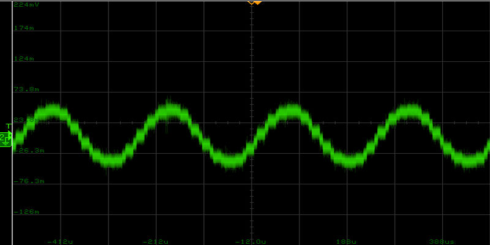
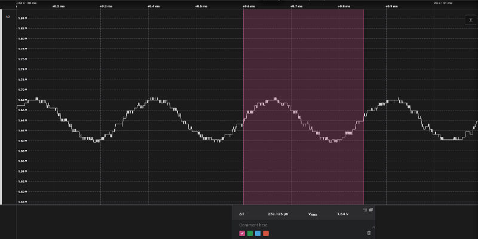

# Platform - I2S Microphone VDAC #

## Overview ##

This example demonstrates the implementation of the I2S protocol for interfacing with an external stereo microphone. The sampled audio signal is then routed to an analog pin via the VDAC.

## SDK version ##

[SiSDK v2025.6.1](https://github.com/SiliconLabs/simplicity_sdk/releases/tag/v2025.6.1)

## Software Required ##

- [Simplicity Studio v5 IDE](https://www.silabs.com/developers/simplicity-studio)

## Hardware Required ##

   - Tested boards for working with this example:

      | Board ID | Description  |
      | ---------------------- | ------ |
      | BRD2601B | [EFR32xG24 Dev Kit](https://www.silabs.com/development-tools/wireless/efr32xg24-dev-kit?tab=overview)|
      | BRD2608A | [EFR32xG26 Dev Kit](https://www.silabs.com/development-tools/wireless/efr32xg26-dev-kit?tab=overview)|

## Connections Required ##

Connect the board via the connector cable to your PC to flash the example.

The table below presents the extension header pin assignments for the VDAC analog output corresponding to the tested MCUs.

| Pin function |EFR32xG24 Dev Kit (BRD2601B)| EFR32xG26 Dev Kit (BRD2608A) |
| -------------| -------------------------- | ---------------------------- |
| VDAC output  | PA05 (EXP12)               | PB05 (EXP12)                 |

## Setup ##

To test this application, either create a project based on an example project or start with an "Empty C Project" project based on the desired hardware.

### Create a project based on an example project ###

1. Make sure that this repository is added to [Preferences > Simplicity Studio > External Repos](https://docs.silabs.com/simplicity-studio-5-users-guide/latest/ss-5-users-guide-about-the-launcher/welcome-and-device-t2abs).

2. From the Launcher Home, add your product name to My Products, click on it, and click on the **EXAMPLE PROJECTS & DEMOS** tab. Find the example project filtering by "i2s".

3. Click the **Create** button on **Platform - I2S Microphone VDAC** example. Example project creation dialog pops up -> click Create and Finish and the project should be generated.

4. Build and flash this example to the board.

### Start with an "Empty C Project" project ###

1. Create an **Empty C Project** project for your hardware using Simplicity Studio 5.

2. Select the subfolder in the `inc` folder that corresponds to your board number. Copy all files from that subfolder into the project root folder (overwriting the existing file).

3. Copy all files in the `src` folders into the project root folder (overwriting the existing file).

4. Install the software components:

    3.1. Open the .slcp file in the project

    3.2. Select the SOFTWARE COMPONENTS tab

    3.3. Install the following components:

    - [Platform] → [Peripheral] → EMLIB → [GPIO]
    
    - [Platform] → [Peripheral] → EMLIB → [USART]

    - [Platform] → [Peripheral] → EMLIB → [VDAC]

    - [Platform] → [Driver] → [DMADRV]

5. Build and flash the project to your board.

## How It Works ##

This example demonstrates the implementation of the I²S protocol for interfacing with a microphone.

Firstly, the I²S data is sampled as a 16bit (int16_t) integer at a baudrate of 3MHz. Then, the left and right audio channels' samples are separated using the LDMA peripheral via separate transfers. 

The left channel's samples (int16_t) are then converted from a 16-bit signed integer to a 12-bit unsigned integer before being transferred to the VDAC channel output buffer via the LDMA peripheral. 

All of the LDMA transfers use ping-pong buffers in order to effectively process data while continuously sampling it from the microphone.

## Test measurement
To validate the implementation, a constant 2000 Hz sine wave was applied to the microphone's input.

The expected output frequency on the left channel is half of the input signal's frequency, resulting in a sine wave with a period of 1 / (2 * 2000) = 250 µs.

  
*Figure 1: Scope capture with a constant 2 kHz audio input to verify the waveform of the signal.*

  
*Figure 2: Logic analyzer capture with a constant 2 kHz audio input to verify the period time of the signal.*

