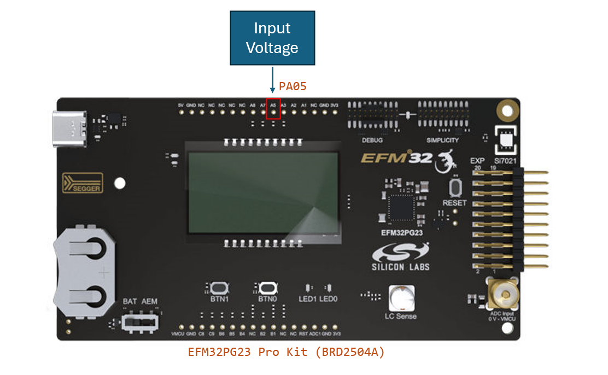
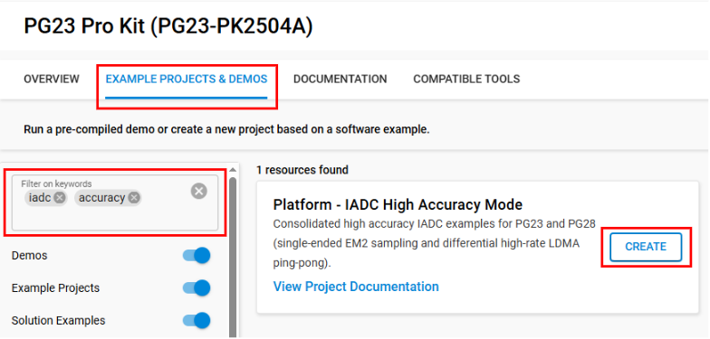
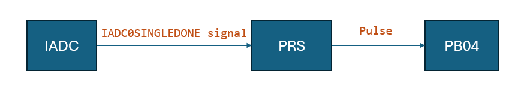
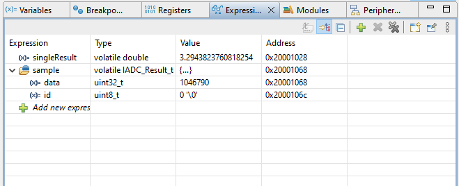
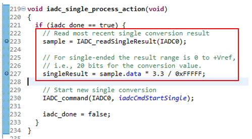
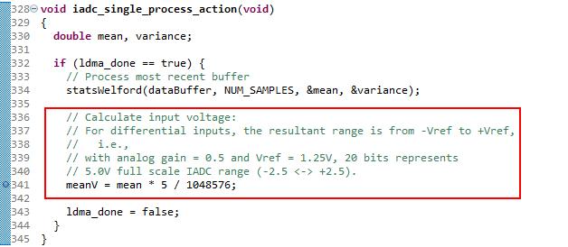
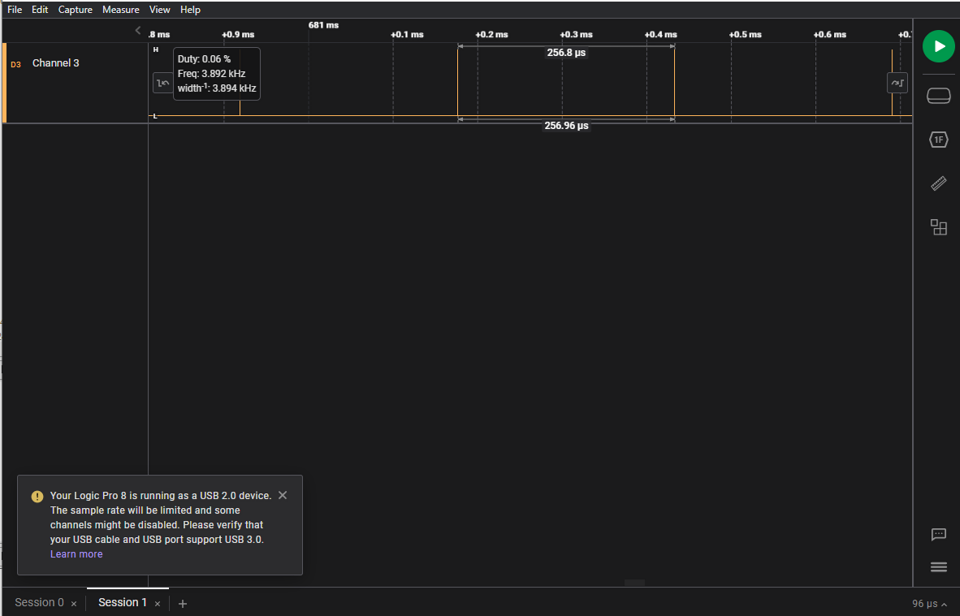
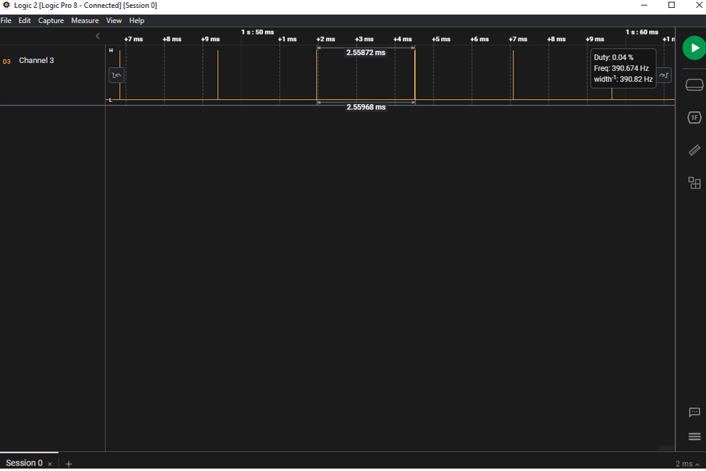

# Platform - IADC High Accuracy Examples #

## Overview ##

This consolidated document covers two high-accuracy IADC example variants:

* PG23 (BRD2504A) – Single-ended GPIO input sampled in EM2 using oversampling and digital averaging to achieve 20-bit results (effective 20-bit raw sample, high-resolution voltage conversion) at ~388 Sps. Firmware converts each raw sample to voltage and uses PRS to pulse a GPIO (PB04) on every conversion completion.
* PG28 (BRD2506A) – Continuous differential measurement (AIN0 vs AIN1) at the maximum 3.8 kSps high-accuracy rate using LDMA ping‑pong buffering of 1024-sample blocks. Statistical (mean / variance) processing is performed on the inactive buffer using a simplified Welford algorithm while acquisition continues.

Both examples demonstrate the IADC high accuracy mode (oversampling rate 256) and appropriate clock/power configuration. Screenshots and signals have been unified under a common `images/` directory.

## SDK Version ##

* [Gecko SDK v4.5.0](https://github.com/SiliconLabs/gecko_sdk/releases/tag/v4.5.0)

## Hardware Required ##

| Variant | Board | Device | Key IADC Features Used |
|---------|-------|--------|------------------------|
| PG23    | EFM32PG23 Pro Kit (BRD2504A) | EFM32PG23B310F512IM48 | Single-ended, oversampling + EM2 operation |
| PG28    | EFM32PG28 Pro Kit (BRD2506A) | EFM32PG28B310F1024IM68 | Differential AIN0/AIN1, LDMA ping‑pong, external ADR1581 reference |

## Connections Required ##

### PG23 (BRD2504A) ###

* Connect the board to the PC via micro-USB.
* Apply an analog voltage (0–VREF) to GPIO PA05 (IADC input).
* Observe PRS conversion pulses on PB04.

  

### PG28 (BRD2506A) ###

* Connect the board to the PC via micro-USB.
* Differential inputs: AIN0 (positive) via SMA, AIN1 (negative) via expansion header pin 3.
* For single-ended testing, jumper expansion header pin 3 to GND (pin 1) so AIN1 = 0 V.
* External ADR1581 circuit provides precision reference.

## Setup ##

You can create a project from the example or start from an empty C project for each variant.

### Create a Project from These Examples ###

1. Add this repository to Simplicity Studio External Repos.
2. From Launcher Home, add the target board to My Products.
3. Filter examples by `iadc` and `accuracy`.
4. Select one of:
   * **Platform IADC High Accuracy Mode - PG23 (BRD2504A)**
   * **Platform IADC High Accuracy Mode - PG28 (BRD2506A)**
5. Click Create / Finish to generate the project.

   

### Start from an Empty C Project ###

1. Create an Empty C Project for the chosen board.
2. Replace source/header files with contents from the corresponding variant directory (`brd2504a/src`, `brd2506a/src`, etc.).
3. Install required software components:
   * Common: IADC, PRS, Power Manager, Sleep Timer (if used), LED (PG23 uses LED0, PG28 may use LED1), LDMA (PG28 only), CMSIS-DSP (PG23 variant uses DSP for potential signal processing or conversion helper).
4. Build and flash.

## How It Works ##

### PG23 – Single Conversion in EM2 ###

* Clock: HFRCOEM23 set to 1 MHz for low-energy operation.
* Oversampling: OSRHA = 256, digital averaging = 2 → Effective oversample factor 512.
* Result: Raw 20-bit sample converted to voltage: `voltage = sample * VREF / (2^20)`.
* PRS pulse on PB04 each conversion (IADC single done routed via PRS).
* MCU wakes on IADC interrupt, processes sample, returns to EM2.

  

  

  

### PG28 – Differential Continuous Acquisition with LDMA ###

* Clock: FSRCO selected and prescaled to push IADC to 5 MHz limit for high accuracy mode.
* Oversampling: OSR = 256 → 20-bit conversion (16-bit ENOB typical).
* Sampling Rate: Achieves ~3.8 kSps high-accuracy maximum.
* LDMA: Two 1024-sample ping‑pong buffers. While one fills, the other is processed (mean & variance via simplified Welford algorithm). LED1 toggles after each buffer transfer.
* Differential Inputs: AIN0 (+) vs AIN1 (–). External ADR1581 provides reference stability.
* PRS: Pulses PC10 on each conversion completion (~263 µs period).

  

   

## Testing ##

### PG23 Variant ###

1. Flash the PG23 project.
2. Open debugger; add `sample` and `singleResult` to Expressions.
3. Apply a voltage to PA05; observe raw sample and converted voltage updating at ~388 Sps.
4. Verify PRS pulses on PB04 align with conversion timing (~2.6 ms period with digital averaging).

   

### PG28 Variant ###

1. Flash the PG28 project.
2. Observe PC10 pulses (~263 µs apart) indicating 3.8 kSps sampling.
3. Set a breakpoint in the processing routine (e.g., where mean/meanV computed) to inspect buffer statistics after LDMA completion.
4. For differential measurement: Apply small voltage difference between AIN0 and AIN1. For single-ended, ground AIN1.
5. Verify LED1 toggles after each 1024-sample LDMA transfer.

## Notes ##

* High accuracy mode increases conversion time; throughput depends on oversampling and digital averaging settings.
* PG23 focuses on low-energy EM2 single-ended sampling; PG28 focuses on throughput and continuous differential statistics.
* Adjust prescalers or oversampling to trade resolution vs speed.

## License ##

Zlib – see project sources for full license text.
