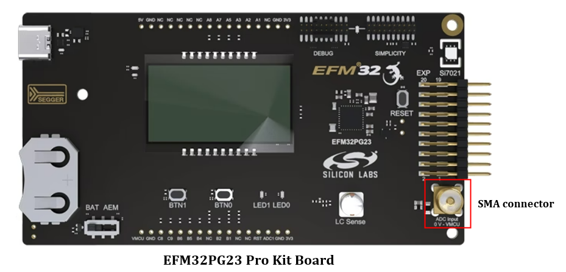
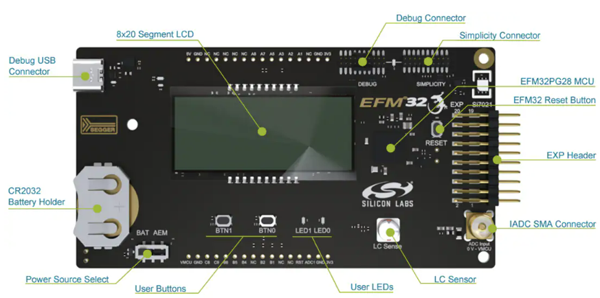
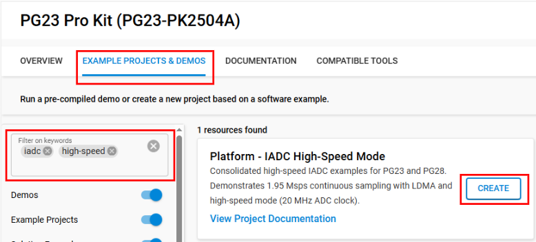
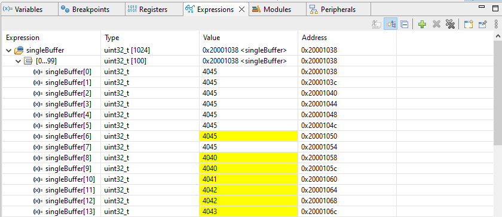
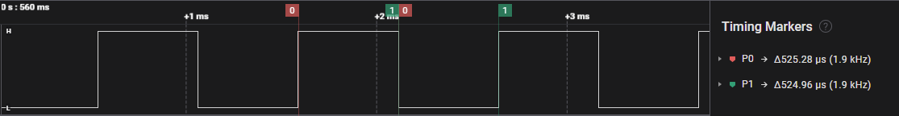
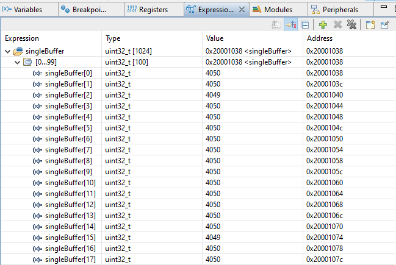
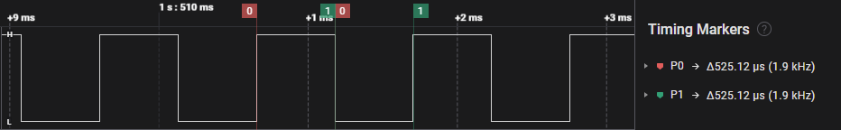

# Platform - IADC High-Speed Mode #

## Overview ##

This consolidated project demonstrates IADC high-speed mode operation on both PG23 and PG28 platforms:

* **PG23 (BRD2504A)** – Continuously samples analog input from SMA connector at 1.95 Msps using 12-bit resolution. IADC clock is doubled to 20 MHz (vs 10 MHz normal mode) from 39 MHz HFXO with /2 prescaler. LDMA transfers 1024 samples into buffer. Output pulse on PA5 every ~525 µs (1024-sample period).
* **PG28 (BRD2506A)** – Same 1.95 Msps continuous sampling via SMA with 12-bit ADC results. IADC clocked from 39 MHz HFXO with /2 prescaler. LDMA ping-pong buffering of 1024 samples. Output pulse on PB1 every ~525 µs.

Both examples use the IADC high-speed feature to achieve 20 MHz ADC clock speed for rapid acquisition, demonstrating oversampling and LDMA-driven continuous conversion ideal for high-throughput signal processing.

## SDK Version ##

* [Simplicity SDK v2025.6.2](https://github.com/SiliconLabs/simplicity_sdk/releases/tag/v2025.6.2)

## Hardware Required ##

| Variant | Board | Device | ADC Input | Output Pin |
|---------|-------|--------|-----------|------------|
| PG23    | EFM32PG23 Pro Kit (BRD2504A) | EFM32PG23B310F512IM48 | SMA connector | PA5 |
| PG28    | EFM32PG28 Pro Kit (BRD2506A) | EFM32PG28B310F1024IM68 | SMA connector | PB1 |

## Connections Required ##

### PG23 (BRD2504A) ###

* Connect board to PC via USB Type-C.
* Apply analog voltage (0–VDD) to SMA connector.
* Observe output pulse on PA5 (expansion header or probe point).

  

### PG28 (BRD2506A) ###

* Connect board to PC via USB Type-C.
* Apply analog voltage (0–VDD) to SMA connector.
* Observe output pulse on PB1 (expansion header or probe point).

  

## Setup ##

You can create a project from the example or start from an empty C project for each variant.

### Create a Project from This Example ###

1. Add this repository to Simplicity Studio External Repos.
2. From Launcher Home, add your target board (BRD2504A or BRD2506A) to My Products.
3. Filter examples by `iadc` and `high-speed`.
4. Select **Platform - IADC High-speed Mode** for your board.
5. Click Create / Finish to generate the project.

   

### Start from an Empty C Project ###

1. Create an Empty C Project for the chosen board.
2. Copy source/header files from the `src/pg23` or `src/pg28` directory (depending on your board) into your project.
3. Install required software components:
   * [Platform] → [Peripheral] → [IADC]
   * [Platform] → [Peripheral] → [LDMA]
4. Build and flash.

## How It Works ##

### Common Operation ###

Both variants configure IADC for continuous single-channel sampling in high-speed mode:

* **Clock Source**: 39 MHz HFXO divided by 2 → 19.5 MHz IADC base clock. High-speed mode doubles internal ADC clock to 20 MHz (10 MHz in normal mode).
* **Resolution**: 12-bit ADC results (0–4095 scale for 0–VDD input).
* **Sampling Rate**: 1.95 Msps continuous.
* **LDMA**: Transfers ADC results into 1024-sample buffer. When buffer fills, output GPIO toggles and DMA restarts (ping-pong in PG28, simple continuous in PG23).

### PG23 Variant ###

* IADC samples SMA input continuously.
* LDMA moves results to `singleBuffer[1024]`.
* PA5 output pulses every 1024 samples (~525 µs period).
* Firmware can inspect `singleBuffer` in debugger to see voltage samples.

### PG28 Variant ###

* Similar operation but output pulse routed to PB1.
* Same 1024-sample buffer and ~525 µs period.
* Identical 12-bit ADC scaling (0–4095 for VDD reference).

## Testing ##

### PG23 Variant ###

1. Flash PG23 project.
2. Open Simplicity Debugger; add `singleBuffer` variable from `iadc_single.c` to Expressions.
3. Apply voltage to SMA connector (0–VDD range).
4. Observe `singleBuffer` array populated with 1024 12-bit ADC samples.
5. Use oscilloscope on PA5 to verify ~525 µs pulse period (1.9 kHz).

   

   

### PG28 Variant ###

1. Flash PG28 project.
2. Open debugger; add `singleBuffer` to Expressions.
3. Apply voltage to SMA connector.
4. Observe buffer updating with 1024 samples reflecting input voltage.
5. Probe PB1 for ~525 µs pulse period.

   

   

### Common Testing Notes ###

* Applying VMCU (~3.3 V) to SMA should yield ADC values near 4095.
* Applying GND should yield values near 0.
* Suspend debugger to inspect voltage changes; buffer updates on every DMA completion.

## Notes ##

* High-speed mode is critical for 1.95 Msps throughput; normal mode cannot sustain this rate.
* Both platforms achieve identical performance despite different GPIO assignments.
* Adjust oversampling or prescaler to trade speed vs resolution if needed.

## License ##

Zlib – see project sources for full license text.
