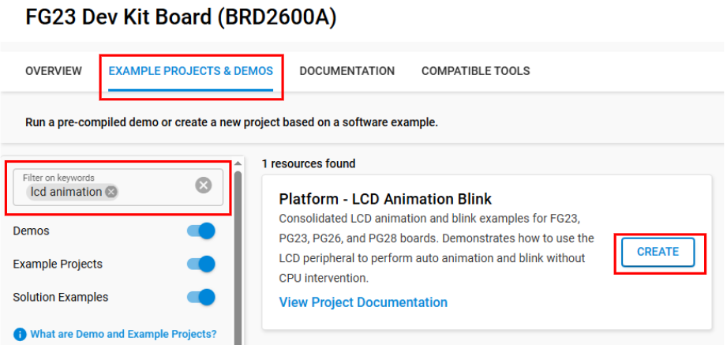
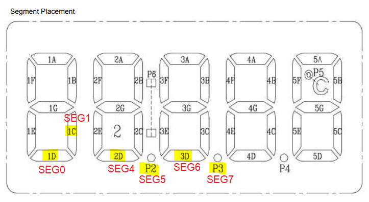
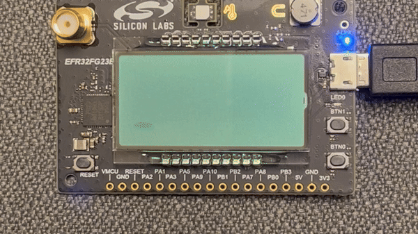
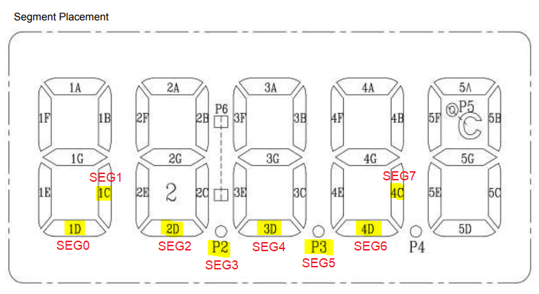
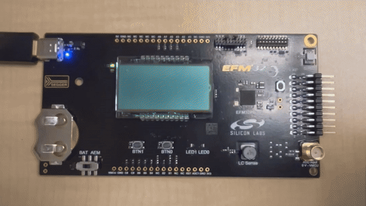
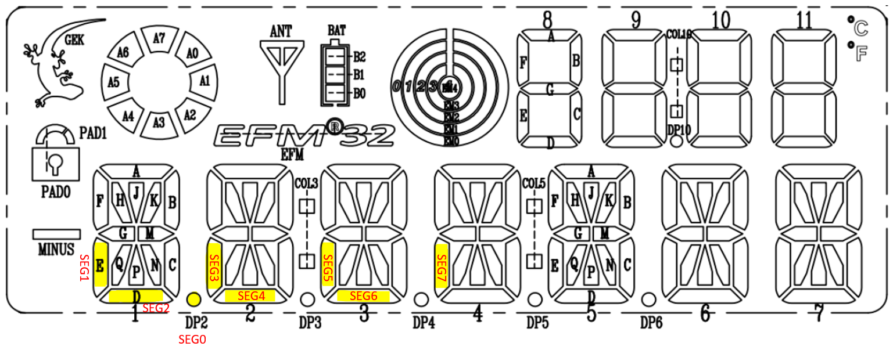

# Platform - LCD Animation Blink #

## Overview ##

This project demonstrates how to use the LCD (Liquid Crystal Display) peripheral on various EFM32 and EFR32 development boards to perform auto animation and blink without CPU intervention. The LCD peripheral can execute specialized patterns on the segment LCD while the microcontroller remains in Low Energy Mode, allowing for energy-efficient display animations.

This consolidated example supports four board variants:

* **FG23 (BRD2600A)** – Uses segments 0-1 and 4-7 (6 segments total) controlled by COM0 for animation and blinking at 2Hz
* **PG23 (BRD2504A)** – Uses segments 0-7 (8 segments total) controlled by COM0 with CPU in EM2 sleep mode for energy saving
* **PG26 (BRD2505A)** – Uses segments 0-7 (8 segments total) controlled by COM0 with LFXO clock source and LCD_E301 erratum workaround
* **PG28 (BRD2506A)** – Uses segments 0-7 (8 segments total) controlled by COM0 for animation and blinking at 2Hz

More information on [How it works](#how-it-works) below.

## SDK Version ##

* [Simplicity SDK v2025.6.2](https://github.com/SiliconLabs/simplicity_sdk/releases/tag/v2025.6.2)

## Hardware Required ##

| Board   | Board Name                       | Device                    | Notes                                    |
|---------|----------------------------------|---------------------------|------------------------------------------|
| FG23    | EFR32FG23 Dev Kit (BRD2600A)     | EFR32FG23B010F512GM48     | Only segments 0-1 and 4-7 mapped to LCD  |
| PG23    | EFM32PG23 Pro Kit (BRD2504A)     | EFM32PG23B310F512IM48     | Full segment 0-7 support                 |
| PG26    | EFM32PG26 Pro Kit (BRD2505A)     | EFM32PG26B500F3200IL136   | Uses LFXO, requires microsecond delay    |
| PG28    | EFM32PG28 Pro Kit (BRD2506A)     | EFM32PG28B310F1024IM68    | Full segment 0-7 support                 |

## Connections Required ##

### FG23 (BRD2600A) ###

Connect the board via a micro-USB cable to your PC to flash the example.

### PG23 (BRD2504A) ###

Connect the board via a micro-USB cable to your PC to flash the example.

### PG26 (BRD2505A) ###

Connect the board via a USB-C cable to your PC to flash the example.

### PG28 (BRD2506A) ###

Connect the board via a micro-USB cable to your PC to flash the example.

## Setup ##

To test this application, you can either create a project based on an example project or start with an empty example project.

### Create a project based on an example project ###

1. Make sure that this repository is added to [Preferences > Simplicity Studio > External Repos](https://docs.silabs.com/simplicity-studio-5-users-guide/latest/ss-5-users-guide-about-the-launcher/welcome-and-device-tabs).

2. From the Launcher Home, add your board to My Products, click on it, and click on the **EXAMPLE PROJECTS & DEMOS** tab. Find the example project filtering by **'lcd animation'**.

3. Click the **Create** button on the **Platform - LCD Animation Blink** example. Example project creation dialog pops up -> click **Finish** and Project should be generated.

    

4. Build and flash this example to the board.

### Start with an empty example project ###

1. Create an **Empty C Project** project for your hardware using Simplicity Studio 5.

2. Copy the appropriate `app.c` and `main.c` files from the `src/<board>` folder to your project, and copy `app.h` from the `inc/<board>` folder.

3. Open the .slcp file. Select the SOFTWARE COMPONENTS tab and install the software components:

    * [Platform] → [Peripheral] → [LCD]
    * [Services] → [Power Manager] → [Power Manager]
    * [Platform] → [Utilities] → [Microsecond Delay] (PG26 only)

4. Build and flash the project to your device.

## How It Works ##

All boards support the segment LCD peripheral with hardware animation capabilities.

### Animation Feature ###

A maximum of 8 segments can be used for the animation feature. They can either be segments 0-7 controlled by COM0 or segments 8-15 controlled by COM0. The animation is implemented as two programmable 8-bit registers that are shifted either left or right for every other animation state for a total of 16 states:

* The LCD_AREGA register is shifted in every odd state
* The LCD_AREGB register is shifted in every even state
* The two registers can either be OR'ed or AND'ed to achieve the desired animation pattern

The animation state machine is described in section 27.3.13.3 (FG23/PG23), 31.3.13.3 (PG26), or 26.3.13.3 (PG28) of the respective reference manuals.

### Blink Feature ###

The LCD peripheral can also blink at a frequency given by CLKevent every 2Hz. The segments will be alternating between on and off when the LCD is blinking. Refer to section 27.3.13.1 (FG23/PG23), 31.3.13.1 (PG26), or 26.3.13.1 (PG28) of the reference manual for more information regarding the blinking feature.

### Board-Specific Implementation ###

#### FG23 (BRD2600A) ####

The BRD2600A board only maps segments 0-1 and segments 4-7 to the segment LCD panel, therefore the animation feature can only control 6 physical LCD segments on this board. The LCD segments controlled by the animation feature are 1D, 1C, 2D, P2, 3D, P3.

**Note**: As seen in the video above, the LCD will be blank for 2 seconds since segments 2 and 3 are not mapped to the onboard LCD.

#### PG23 (BRD2504A) ####

This example uses segments 0-7 that are controlled by COM0 to demonstrate the animation feature. The LCD segments controlled by the animation feature are 1D, 1C, 2D, P2, 3D, P3, 4D, 4C. The CPU remains in EM2 sleep mode for energy saving.

#### PG26 (BRD2505A) ####

This example uses segments 0-7 that are controlled by COM0 to demonstrate the animation feature. The LCD segments controlled by the animation feature are DP2, 1E, 1D, 2E, 2D, 3E, 3D, and 4E. This board uses LFXO as the clock source and includes a workaround for the LCD_E301 erratum by performing a sequential write to AREGA with a delay.

#### PG28 (BRD2506A) ####

This example uses segments 0-7 that are controlled by COM0 to demonstrate the animation feature. The LCD segments controlled by the animation feature are DP2, 1E, 1D, 2E, 2D, 3E, 3D, and 4E.

## Testing ##

1. Build and flash the hex image onto the board. Reset the board and observe the segment LCD displaying animation at a 2Hz rate.
2. Change BLINK_ENABLE define on line 30 (FG23/PG23/PG28) or line 33 (PG26) of the `app.c` file to 1.
3. Rebuild and flash the hex image onto the board. Reset the board and observe the segment LCD displaying animation and blinking at a 2Hz rate. This example runs as it is and requires no user intervention.

**Note**: The blink feature is not enabled in the demo videos by default.
