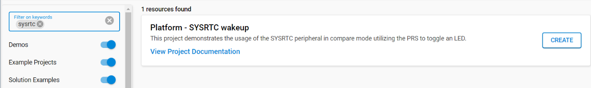

# Platform - Sysrtc Wakeup #

## Overview ##

This project demonstrates the usage of the SYSRTC peripheral in compare mode utilizing the PRS to toggle an LED.

## SDK version ##

- [SiSDK v2024.12.2](https://github.com/SiliconLabs/simplicity_sdk/tree/v2024.12.2)

## Hardware Required ##

- [EFR32FG25 902-928 MHz +16 dBm Radio Board](https://www.silabs.com/development-tools/wireless/proprietary/fg25-rb4270b-efr32fg25-radio-board?tab=overview)

- Wireless Starter Kit (WSTK) BRD4001, or Wireless Pro Kit (WPK) BRD4002 mainboard.

**Note:**

   - Tested boards for working with this example: 

      | Board ID | Description  |
      | ---------------------- | ------ |
      | BRD4186c | [EFR32xG24 Wireless 2.4 GHz +10 dBm Radio Board](https://www.silabs.com/development-tools/wireless/xg24-rb4186c-efr32xg24-wireless-gecko-radio-board?tab=overview)|
      | BRD4270b | [EFR32FG25 902-928 MHz +16 dBm Radio Board](https://www.silabs.com/development-tools/wireless/proprietary/fg25-rb4270b-efr32fg25-radio-board?tab=overview)|
      | BRD4400c | [EFR32xG28 2.4 GHz BLE and +14 dBm Radio Board](https://www.silabs.com/development-tools/wireless/xg28-rb4400c-efr32xg28-2-4-ghz-ble-and-14-dbm-radio-board?tab=overview)|
      | BRD2504a | [EFM32PG23 Pro Kit](https://www.silabs.com/development-tools/mcu/32-bit/efm32pg23-pro-kit?tab=overview)|
      | BRD2506a | [EFM32PG28 Pro Kit](https://www.silabs.com/development-tools/mcu/32-bit/efm32pg28-pro-kit?tab=overview)|

**Wireless stack compatibility:**

Sleeptimer is a commonly used component in most Silicon Laboratories radio stacks. By default, Sleeptimer uses SYSRTC as its underlying hardware timer. In such cases, it is not possible for user software to make use of SYSRTC. However, Sleeptimer can use other hardware timers, so if SYSRTC is needed by the application, it may be possible to use an alternate timer, such as the BURTC.

Additionally, other software components, such as the HFXO Manager, FreeRTOS, and Micrium RTOS, make use of SYSRTC or Sleeptimer. Be sure to examine software component dependencies when attempting to write firmware that directly controls SYSRTC.

## Connections Required ##

Connect the board via the connector cable to your PC to flash the example.

## Setup ##

To test this application, you can either create a project based on an example project or start with an "Empty C Project" project based on your hardware.

### Create a project based on an example project ###

1. Make sure that this repository is added to [Windows > Preferences > Simplicity Studio > External Repos](https://docs.silabs.com/simplicity-studio-5-users-guide/latest/ss-5-users-guide-about-the-launcher/welcome-and-device-tabs).

2. From the Launcher Home, add your product name to My Products, click on it, and click on the **EXAMPLE PROJECTS & DEMOS** tab. Find the example project filtering by "SYSRTC".

3. Click the **Create** button on **Platform - SYSRTC wakeup** example. Example project creation dialog pops up -> click Create and Finish and the project should be generated.

4. Build and flash this example to the board.

### Start with an "Empty C Project" project ###

1. Create an **Empty C Project** project for your hardware using Simplicity Studio 5.

2. Copy all files in the `inc` and `src` folders into the project root folder (overwriting the existing file).

3. Install the software components:

    3.1. Open the .slcp file in the project

    3.2. Select the SOFTWARE COMPONENTS tab

    3.3. Install the following components:

    - [Platform] → [Driver] → [Simple_LED]  → [led0]

    - [Platform] → [Peripheral] → [PRS]

    - [Platform] → [Peripheral] → [SYSRTC]
   
4. Build and flash the project to your board.

## How It Works ##

The example showcases the SYSRTC peripheral automatically toggling a GPIO pin.

Configured for compare mode, it leverages the PRS (Peripheral Reflex System) to toggle the GPIO on every compare event.

An interrupt from the SYSRTC handles updates for subsequent compare events.

Between these active periods, the device remains in Energy Mode 3 (EM3).
