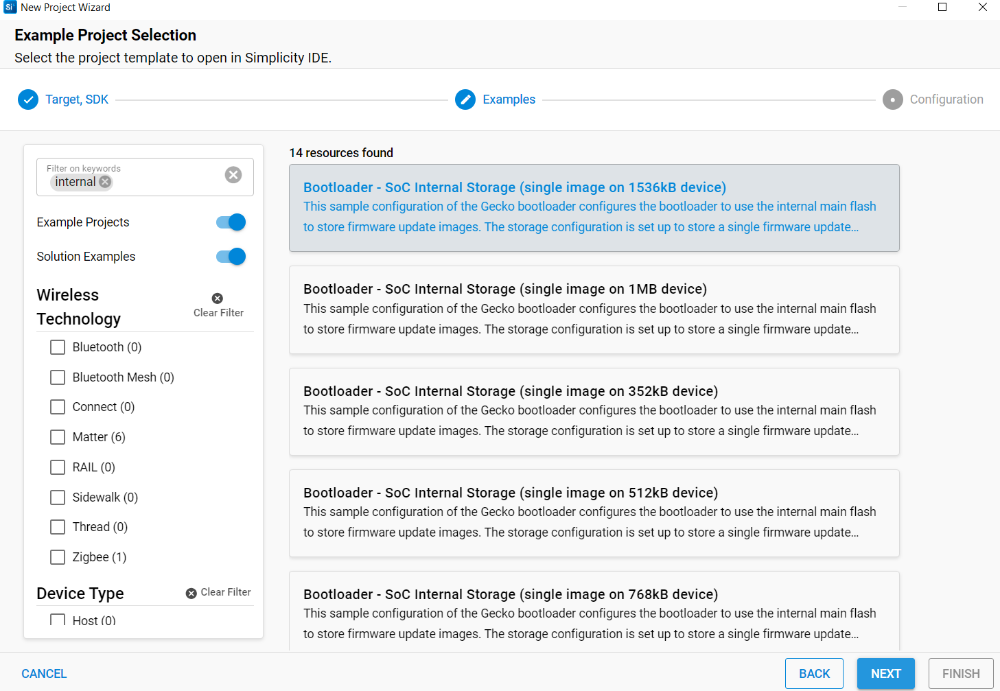
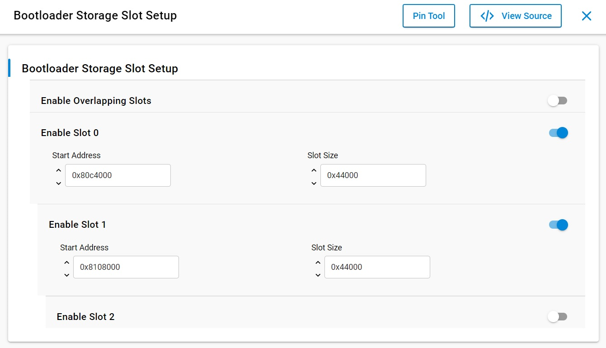
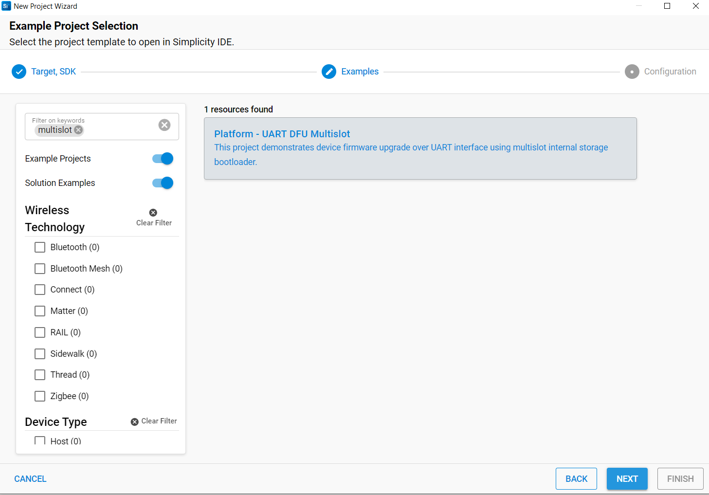

# Platform - UART DFU Multislot #

## Overview ##

This project demonstrates device firmware upgrade over UART interface using multislot internal storage bootloader.

The project consists of three components: the bootloader, the target application, and the host application. The bootloader and target application run on the EFx32 board, while the host application runs on the user's PC.

The bootloader is an internal storage bootloader configured to support two storage slots. 

The host application running on the user's PC transfers the firmware upgrade image to the target application on the EFx32 board over the UART interface.
The host application allows you to select which storage slot to store the upgrade image in.

Once the firmware images are stored in one or both slots, the host application selects the slot from which the firmware upgrade should occur and sends a command to the target application. Upon receiving the firmware upgrade command, the target application invokes a Bootloader API to complete the upgrade.  

Peripherals used: USART in UART mode.

## SDK version ##

- SiSDK v2025.6.1

## Hardware Required ##

* Boards: Silicon Labs Wireless Pro Kit Mainboard (SLWMB4002A, formerly BRD4002A) with one of the following supported radio boards.
* Devices: EFR32xG24

| Board ID | Description  |
| ---------------------- | ------ |  
| BRD4186C | [EFR32xG24 Wireless 2.4 GHz +10 dBm Radio Board](https://www.silabs.com/development-tools/wireless/xg24-rb4186c-efr32xg24-wireless-gecko-radio-board?tab=overview)|
| BRD4187C | [EFR32xG24 Wireless 2.4 GHz +20 dBm Radio Board](https://www.silabs.com/development-tools/wireless/xg24-rb4187c-efr32xg24-wireless-gecko-radio-board?tab=overview)|
	  
## Connections Required ##

Connect the board to your PC using a micro-USB cable. This connection is used for flashing the example and for establishing the VCOM connection to the host PC.

## Setup ##
To test this application, you need to build the bootloader, the target application, and the host application as described below.

### Create the bootloader image ###

1. From the Launcher Home, add your board to My Products, click on it, and click on the **EXAMPLE PROJECTS & DEMOS** tab. Find the example project filtering by **'internal'**.

2. Click on the **Next** button on the **Bootloader - SoC Internal Storage (single image on 1536kB device)** example. Example project creation dialog pops up -> click **Finish** and the project should be generated.

3. In the SOFTWARE COMPONENTS tab, navigate to [Platform] → [Bootloader] → [Storage] → [Bootloader Storage Slot Setup]. Set Slot 0 **Start Address** to 0x80c4000 and **Slot Size** to 0x44000. Enable Slot 1 and set **Start Address** to 0x8108000 and **Slot Size** to 0x44000. 

4. Build and flash this bootloader to the board.

### Create the target application image ###

1. Ensure that this repository is added to [Preferences > Simplicity Studio > External Repos](https://docs.silabs.com/simplicity-studio-5-users-guide/latest/ss-5-users-guide-about-the-launcher/welcome-and-device-tabs).

2. From the Launcher Home, add your board to My Products, click on it, and click on the **EXAMPLE PROJECTS & DEMOS** tab. Find the example project by filtering using **'multislot'**.

3. Click on the **Next** button on the **Platform - UART DFU Multislot** example. Example project creation dialog pops up -> click **Finish** and the project should be generated.

4. Build and flash this example to the board.

### Create the host application image ###

1. Copy the file **"platform_uart_dfu_multislot_host.c"** from the folder **"host_application"** to a directory on your host PC.

2. Use a C compiler on your host PC to compile and build the host application.

3. For example, on a Windows PC with MinGW installed, you can build the host application using the following command:
**"C:\MinGW\bin\gcc.exe platform_uart_dfu_multislot_host.c -o platform_uart_dfu_multislot_host"**

## How It Works ##

When using the internal storage bootloader, the target application is responsible for downloading the firmware upgrade image and storing it in one of several storage slots in flash using Bootloader APIs. The firmware image can be downloaded either over-the-air (OTA) or via a communication interface such as UART or I2C. In this example, the UART interface is used to download the firmware image.

Once the firmware image is successfully downloaded to a storage slot, the target application invokes a Bootloader API to copy the image from the storage slot to the application area in flash.

The internal storage bootloader supports up to three storage slots. The start addresses and sizes of the storage slots are configurable. As it allows multiple firmware upgrade images to be stored in flash, it provides additional robustness and flexibility in implementing the upgrade procedure.

## Testing ##

The host application supports two commands:

**1. Downloading a FW Image to a storage slot**

To download a firmware image, use: **platform_uart_dfu_multislot_host.exe -d filename slot(0|1) serialport**
For example: platform_uart_dfu_multislot_host.exe -d application.gbl 0 COM5

You can run this command multiple times to store different firmware images in the storage slots.

**2. Upgrading the target application from a storage slot**

To upgrade the target application from a storage slot, use: **platform_uart_dfu_multislot_host.exe -u slot(0|1) serialport**
For example: platform_uart_dfu_multislot_host.exe -u 1 COM5

After running this command, the target application will be upgraded using the firmware image present in the selected storage slot.